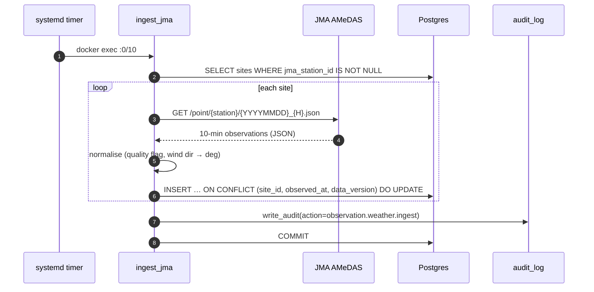
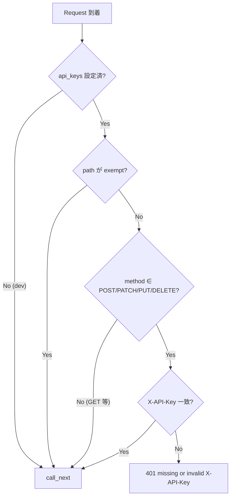
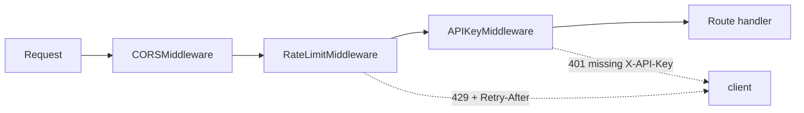
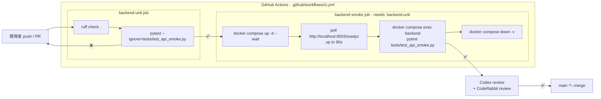

# 🏛️ アーキテクチャ

## 1. レイヤと責務

```mermaid
flowchart TB
  subgraph FE[Frontend - React 18 + Vite 6]
    UI[Dashboards / Admin pages]
    API_TS[src/api.ts adapter]
    UI --> API_TS
  end

  subgraph EDGE[Edge - nginx 1.27-alpine]
    NX[Vite 静的配信 ＋<br/>/api/ reverse proxy<br/>resolver lazy DNS]
  end

  subgraph BE[Backend - FastAPI]
    R[Routers<br/>app/api/*.py]
    SCH[Schemas<br/>Pydantic v2]
    SVC[Services<br/>decision / audit / jma]
    MDL[Models<br/>SQLAlchemy 2.0 async]
    MW[Middleware<br/>APIKey + RateLimit + CORS]
    R --> SCH
    R --> SVC
    SVC --> MDL
    MW -.wraps.-> R
  end

  subgraph DB[(Postgres 16)]
    T1[sites]
    T2[thresholds]
    T3[weather_observations]
    T4[marine_observations]
    T5[decisions]
    T6[audit_log]
  end

  subgraph JOB[Periodic jobs]
    J1[app/jobs/ingest_jma.py<br/>AMeDAS 10min]
    J2[app/jobs/ingest_jma_marine.py<br/>wave nowcast hourly]
  end

  API_TS -- HTTP JSON --> NX
  NX -- /api/ proxy --> MW
  MDL --> DB
  J1 --> MDL
  J2 --> MDL
```

## 2. データフロー（観測値 ingest）



### 冪等性

自然鍵 `(site_id, observed_at, data_version)` への `ON CONFLICT DO UPDATE` 設計により、
同じ 10 分ウィンドウを何度取り込んでも観測値は最新値で **上書きされるだけ**。
これは systemd timer の `Persistent=true` による「停止中の取りこぼし → 起動時に
catch-up 実行」と組み合わせて、運用中断に強い ingest を実現する。

## 3. 判定ロジック (Decisions)

```mermaid
flowchart LR
  IN[POST /decisions<br/>{site_id, work_type,<br/>window_start, window_end}]
  Q[SELECT 観測値 BETWEEN t0..t1]
  TH[SELECT thresholds<br/>site_id=X OR site_id IS NULL]
  CALC{各メトリクス vs 閾値}
  OUT[判定: ok / warn / stop<br/>+ 触発したメトリクス一覧]

  IN --> Q --> CALC
  IN --> TH --> CALC
  CALC --> OUT
```

### 閾値 OR-merge

`thresholds` 行は `site_id` を NULL にできる（＝全社デフォルト）。同じ `work_type`
について **サイト個別 行 と グローバル NULL 行 の和** を取り、サイト個別が
優先される。これは「現場ごとの上書き」を 1 テーブルで扱う実用的な圧縮表現。

## 4. 認証 (APIKeyMiddleware)



### 設計上のポイント

| 項目 | 採用 | 理由 |
|---|---|---|
| 比較 | `hmac.compare_digest` | タイミング攻撃で長さプレフィックスを推定されない |
| middleware 順 | `app.add_middleware(APIKey)` → `add_middleware(CORS)` | 後 add したものが先に実行される（Starlette 仕様）。CORS が先に走れば 401 にも CORS ヘッダが乗りブラウザがレスポンスを読める |
| exempt の `"/"` | ルートだけ完全一致のみ | 素朴な prefix マッチだと `/api/v1/...` まで全部素通りしてしまう致命バグになる |
| dev mode | `api_keys = []` で auth 全無効 | ローカル開発の摩擦を減らす |

## 4.1 レート制限 (RateLimitMiddleware)



`add_middleware` は **後 add したものが先に走る** Starlette 仕様に従い、
`main.py` では `APIKey → RateLimit → CORS` の順に登録している。実行順は逆で
CORS → RateLimit → APIKey になり、ねらいは:

- CORS が一番外なので 401/429 にも `Access-Control-*` が乗り、ブラウザ JS が
  エラー本体を読める
- RateLimit が auth より前にあるので、攻撃トラフィックを `hmac.compare_digest`
  のループに到達させずに弾ける（CPU 増幅攻撃の遮断）
- RateLimit は **`X-API-Key` の SHA-256 先頭 16 桁** を identity に使うので、
  認証前でもキー単位の bucket を切れる。生キーをログに残さない設計

### 設計上のポイント

| 項目 | 採用 | 理由 |
|---|---|---|
| アルゴリズム | sliding window deque | 60-s 内のヒットを timestamp で保持。固定 token bucket より burst 制御がシンプル |
| 識別 | `sha256(X-API-Key)[:16]` または client IP | 生キーを bucket dump / ログに残さない |
| `_MAX_IDENTITIES=4096` | 古い entry を FIFO 退避 | 攻撃者が key を回転して memory 枯渇させるのを防ぐ |
| 対象 method | `POST/PATCH/PUT/DELETE` のみ | GET はダッシュボードが叩くので open のまま |
| exempt | `/healthz`, `/readyz` のみ | systemd/k8s の liveness probe を 429 で殺さない |
| store | プロセス常駐 dict | uvicorn 1 コンテナ前提。複製増えたら Redis に差し替え (`_buckets` の seam を維持) |

## 5. 監査ログ

業務 audit は **サービス層から明示的に呼ぶ** ベストエフォート設計：

- 認証失敗 → `log.warning` のみ（DB に書かない。SN 比を保つ）
- 業務 mutation 成功 → `write_audit(actor, action, detail)` を呼んで DB へ
- 失敗時は warn ログにとどめ、リクエストは正常応答（best-effort）

「決済級の監査が必要になったら outbox パターンに移行」と
`backend/app/services/audit.py` のドキュメント文字列に明記してある。

## 6. テスト戦略

| レイヤ | 道具 | 例 |
|---|---|---|
| 純粋関数 | `pytest` + 入力データ直接渡し | `services/jma.py` の `normalise` |
| 外部 HTTP | `httpx.MockTransport` | JMA fetcher の 404/200/フォールバック |
| Middleware | `FastAPI` mini-app + `TestClient` + `monkeypatch` | API Key auth |
| API 黒箱 | 起動中の compose に対し HTTP リクエスト | `tests/test_api_smoke.py` |

データ汚染対策として、スモークテストの ingest は `data_version=999` を使い、
本番 ingest（`data_version=1`）と一意制約レベルで分離している。

## 7. 採用しなかった選択肢

| 候補 | 不採用理由 |
|---|---|
| Celery + Redis | 10 分粒度のシンプル ingest に重すぎる。systemd timer で十分 |
| JWT 認証 | 操作者は社内の少人数。API Key 数本で運用と監査が両立 |
| audit ミドルウェアで全リクエスト記録 | 失敗・認可拒否まで業務 audit に混入し SN 比が悪化 |
| GraphQL | クライアントが固定（自社フロント 1 つ）。REST で十分 |
| 別 ingest プロセス DB アカウント | プロジェクト規模では運用負荷の方が大きい |

## 8. 既知の課題 / TODO

- [x] 波浪（marine）の ingester は AMeDAS と別エンドポイントなので別ジョブにする — **2026-05-27 実装済み** (`app/services/jma_wave.py` + `app/jobs/ingest_jma_marine.py` + hourly `wmcdss-jma-fetch-marine.timer`)。Issue #2 完。URL 実機検証は Month 5 pre-launch OPERATOR TODO として `jma_wave.py` 冒頭に明記
- [ ] Decisions の閾値 OR-merge は now SQL でやっているが、メトリクスが増えたら view 化を検討
- [x] フロントは Babel Standalone（プロトタイプ）。本番化前にビルド導入 — **2026-05-27 実装済み** (Phase 1 で 15 ページ全 ESM port 完 → Phase 2 入口 Loop 26 で `frontend/vite-app/index.html` を本番 entry 化、Loop 27 で `<MockBanner />` safety parity 回復、Loop 38 で Dockerfile context-escape ＋ nginx eager DNS の 2 件 latent bug を解消、**Loop 44 で `frontend/index.html` ＋ 11 `.jsx` ファイル計 3,190 行を完全退役 — `frontend/vite-app/` のみが唯一の entry point**。`docs/STATUS.md` Loop 25-27 ／ 38 ／ 44 参照)
- [x] CI（GitHub Actions）で pytest を回す — **2026-05-26 実装済み** (§9 参照)

## 9. CI 二段ジョブ構成



### 二段に分けた理由

| ジョブ | 何を守るか | なぜ分離したか |
|---|---|---|
| `backend-unit` (ruff + pytest 純関数) | スタイル退行 / ロジック退行 | DB 不要で 30 秒以内に終わる。落とすなら早く落としたい層 |
| `backend-smoke` (compose 起動 + 黒箱) | 契約退行（audit detail key 欠落、middleware 順、migration 起動不能など） | compose 起動に〜90s かかるので、純関数で落ちるなら先に弾いて CPU 時間を節約 |

`needs: backend-unit` で連鎖させているのは:

- 純関数が落ちている時に compose を起動しても無駄
- ただし unit さえ通ればコミット前 review に出して良い段階に達するので、smoke は **強制ゲート**にせずに「最終 merge までに green であること」をルールにする運用余地を残す（必要なら branch protection で smoke を required にする）

smoke は `tests/test_api_smoke.py` で `target_id` の audit row を **件数厳密**に検証しており（`len(rows) == 1`）、`inputs` / `matched_rules` の永続化契約を CI 内で保証する。ローカルでも同じコマンド (`docker compose exec backend pytest tests/test_api_smoke.py`) で再実行できるので、Verify フェーズでの再現性は維持される。

### backend-smoke の起動待ち

backend コンテナには **Loop 46 で healthcheck を追加** — `python -c 'http.client → GET /readyz; exit 0 if status==200 else 1'` を `interval: 10s / timeout: 5s / retries: 6 / start_period: 30s` で実行。これにより `docker compose up -d --wait` は **healthy 状態（FastAPI 起動 ＋ DB 接続成立 ＋ Loop 45 で 503 化した `/readyz` の 200 応答）** まで待つようになり、`frontend` サービスの `depends_on` も `condition: service_healthy` に格上げされて起動順序が k8s readiness probe と等価になった。CI 側の `/readyz` ポーリング（2 秒間隔 × 最大 45 回 = 90s）は冗長になるが多重防御として残置 — タイムアウト時は引き続き `docker compose logs backend` をダンプして diagnose 可能。実際には `pip install --quiet -e .` が走るため `start_period: 30s` で warm-up を吸収する。

起動順序はその後 **`db-migrate` ワンショットを挟む形へ拡張**された（`db` healthy →
`db-migrate` 完走 → `backend` healthy → `frontend`）。`backend` の `depends_on` は
`condition: service_completed_successfully` なので、スキーマ適用に失敗すれば API は
起動しない。「デプロイは成功したのにスキーマだけ古い」状態を構造的に作らせないための
gate であり、`/readyz` の 200 だけでは検出できない層を塞ぐ（`/readyz` は DB 接続の
成立は見るが、スキーマの版までは見ない）。

CI の `docker compose up -d --wait db backend` は**変更していない**。compose は
`--wait` の**対象として明示された**サービスがワンショットで終了すると、終了コードが
0 でも自身は exit 1 を返す（`container X exited (0)` と表示されたうえで失敗扱い）。
一方 `db-migrate` のように**依存として暗黙に起動されるだけ**のワンショットでは
exit 0 を返す。この差があるため、CI 側は `db backend` を対象にしたままで正しく動く。
`db-migrate` を `--wait` の引数に足すと、成功しているのに CI が落ちる。
