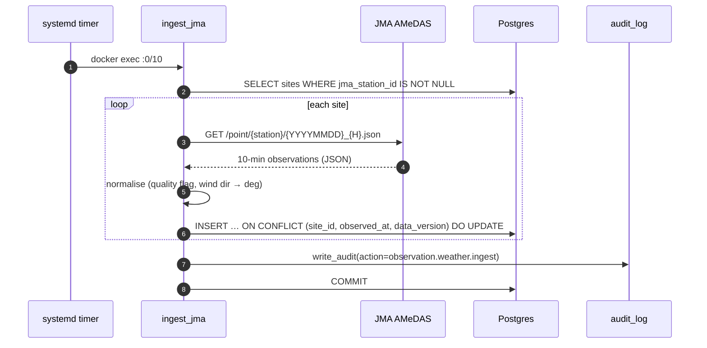
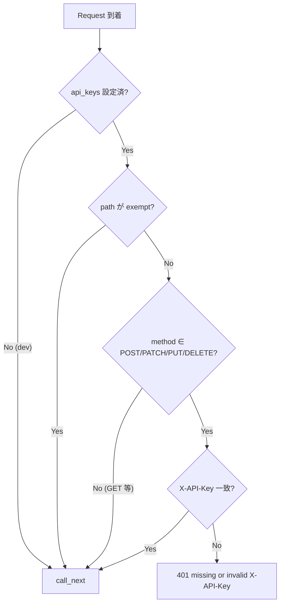
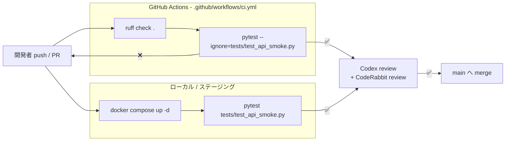

# 🏛️ アーキテクチャ

## 1. レイヤと責務

```mermaid
flowchart TB
  subgraph FE[Frontend - React 18]
    UI[Dashboards / Admin pages]
    API_JS[api.jsx adapter]
    UI --> API_JS
  end

  subgraph BE[Backend - FastAPI]
    R[Routers<br/>app/api/*.py]
    SCH[Schemas<br/>Pydantic v2]
    SVC[Services<br/>decision / audit / jma]
    MDL[Models<br/>SQLAlchemy 2.0 async]
    MW[Middleware<br/>APIKey + CORS]
    R --> SCH
    R --> SVC
    SVC --> MDL
    MW -.wraps.-> R
  end

  subgraph DB[(Postgres 16)]
    T1[sites]
    T2[thresholds]
    T3[weather_observations]
    T4[marine_observations]
    T5[decisions]
    T6[audit_log]
  end

  subgraph JOB[Periodic jobs]
    J[app/jobs/ingest_jma.py]
  end

  API_JS -- HTTP JSON --> MW
  MDL --> DB
  J --> MDL
```

## 2. データフロー（観測値 ingest）



### 冪等性

自然鍵 `(site_id, observed_at, data_version)` への `ON CONFLICT DO UPDATE` 設計により、
同じ 10 分ウィンドウを何度取り込んでも観測値は最新値で **上書きされるだけ**。
これは systemd timer の `Persistent=true` による「停止中の取りこぼし → 起動時に
catch-up 実行」と組み合わせて、運用中断に強い ingest を実現する。

## 3. 判定ロジック (Decisions)

```mermaid
flowchart LR
  IN[POST /decisions<br/>{site_id, work_type,<br/>window_start, window_end}]
  Q[SELECT 観測値 BETWEEN t0..t1]
  TH[SELECT thresholds<br/>site_id=X OR site_id IS NULL]
  CALC{各メトリクス vs 閾値}
  OUT[判定: ok / warn / stop<br/>+ 触発したメトリクス一覧]

  IN --> Q --> CALC
  IN --> TH --> CALC
  CALC --> OUT
```

### 閾値 OR-merge

`thresholds` 行は `site_id` を NULL にできる（＝全社デフォルト）。同じ `work_type`
について **サイト個別 行 と グローバル NULL 行 の和** を取り、サイト個別が
優先される。これは「現場ごとの上書き」を 1 テーブルで扱う実用的な圧縮表現。

## 4. 認証 (APIKeyMiddleware)



### 設計上のポイント

| 項目 | 採用 | 理由 |
|---|---|---|
| 比較 | `hmac.compare_digest` | タイミング攻撃で長さプレフィックスを推定されない |
| middleware 順 | `app.add_middleware(APIKey)` → `add_middleware(CORS)` | 後 add したものが先に実行される（Starlette 仕様）。CORS が先に走れば 401 にも CORS ヘッダが乗りブラウザがレスポンスを読める |
| exempt の `"/"` | ルートだけ完全一致のみ | 素朴な prefix マッチだと `/api/v1/...` まで全部素通りしてしまう致命バグになる |
| dev mode | `api_keys = []` で auth 全無効 | ローカル開発の摩擦を減らす |

## 5. 監査ログ

業務 audit は **サービス層から明示的に呼ぶ** ベストエフォート設計：

- 認証失敗 → `log.warning` のみ（DB に書かない。SN 比を保つ）
- 業務 mutation 成功 → `write_audit(actor, action, detail)` を呼んで DB へ
- 失敗時は warn ログにとどめ、リクエストは正常応答（best-effort）

「決済級の監査が必要になったら outbox パターンに移行」と
`backend/app/services/audit.py` のドキュメント文字列に明記してある。

## 6. テスト戦略

| レイヤ | 道具 | 例 |
|---|---|---|
| 純粋関数 | `pytest` + 入力データ直接渡し | `services/jma.py` の `normalise` |
| 外部 HTTP | `httpx.MockTransport` | JMA fetcher の 404/200/フォールバック |
| Middleware | `FastAPI` mini-app + `TestClient` + `monkeypatch` | API Key auth |
| API 黒箱 | 起動中の compose に対し HTTP リクエスト | `tests/test_api_smoke.py` |

データ汚染対策として、スモークテストの ingest は `data_version=999` を使い、
本番 ingest（`data_version=1`）と一意制約レベルで分離している。

## 7. 採用しなかった選択肢

| 候補 | 不採用理由 |
|---|---|
| Celery + Redis | 10 分粒度のシンプル ingest に重すぎる。systemd timer で十分 |
| JWT 認証 | 操作者は社内の少人数。API Key 数本で運用と監査が両立 |
| audit ミドルウェアで全リクエスト記録 | 失敗・認可拒否まで業務 audit に混入し SN 比が悪化 |
| GraphQL | クライアントが固定（自社フロント 1 つ）。REST で十分 |
| 別 ingest プロセス DB アカウント | プロジェクト規模では運用負荷の方が大きい |

## 8. 既知の課題 / TODO

- [ ] 波浪（marine）の ingester は AMeDAS と別エンドポイントなので別ジョブにする
- [ ] Decisions の閾値 OR-merge は now SQL でやっているが、メトリクスが増えたら view 化を検討
- [ ] フロントは Babel Standalone（プロトタイプ）。本番化前にビルド導入
- [x] CI（GitHub Actions）で pytest を回す — **2026-05-26 実装済み** (§9 参照)

## 9. CI / Verify の二段構え



### 二段に分けた理由

| ジョブ | 何を守るか | なぜ CI から smoke を外したか |
|---|---|---|
| ruff | スタイル退行・E701 のような構文クセ | 速く・依存ゼロで落とせる |
| pytest（純関数） | ロジック退行 | DB なしで完結し、< 1 分で終わる |
| pytest smoke（Verify 段） | 契約退行（audit detail key 欠落など） | docker compose の起動が必要で GA runner では割高 |

smoke は `tests/test_api_smoke.py` で `target_id` の audit row を **件数厳密**に検証しており（`len(rows) == 1`）、ここを compose 環境のローカル/ステージングで通すことで `inputs` / `matched_rules` の永続化契約を保証する。
