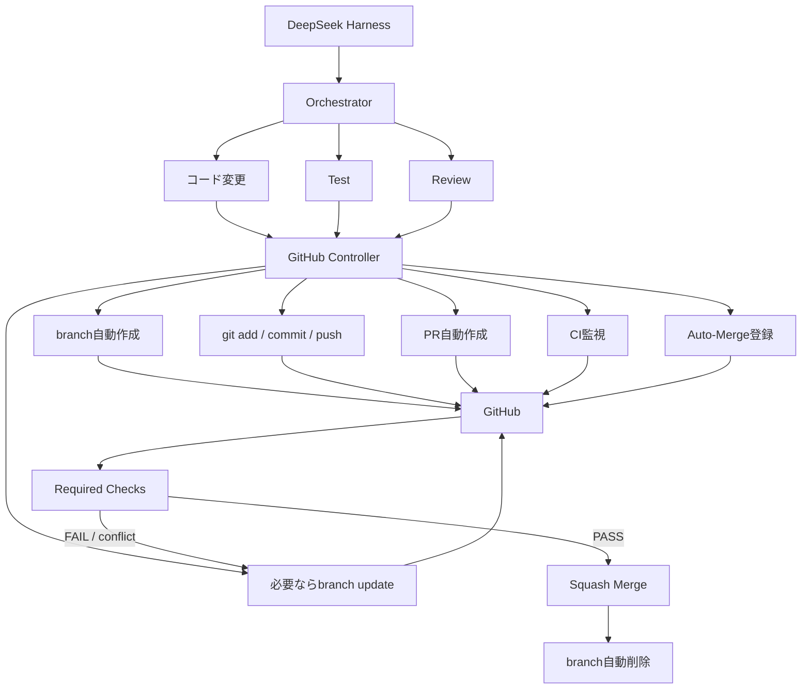

# Cloudflare / Neon / GitHub自動化 運用仕様

状態: 2026-08-15 制定（v1）
正本: 本ファイル、`GITHUB_POLICY.md`

## 1. 目的と適用範囲

Linux上の全Workspaceで、以下を共通基盤として利用する。

- Cloudflare（Workers / Pages / DNS / R2など）のAPI操作と最新ドキュメント調査
- Neon（PostgreSQL）のプロジェクト・DB・スキーマ運用
- GitHubの完全自動フロー（branch作成〜Required Checks通過〜Squash Merge〜branch削除）

認証情報はホストの `~/.bashrc` / `~/.profile` にexport済みの環境変数（`CLOUDFLARE_API_TOKEN` / `CLOUDFLARE_ACCOUNT_ID` / `NEON_API_KEY`）を利用する。本リポジトリおよびWorkspaceには値・credential file・`.env`を保存しない。

## 2. Cloudflare 利用仕様

### 2.1 MCP 2本構成

| MCP名 | 実体 | 用途 |
|---|---|---|
| `cloudflare` | Cloudflare API MCP（Code Mode。`https://mcp.cloudflare.com/mcp`） | Cloudflare APIの実操作（一覧・取得・設定変更・デプロイ） |
| `cloudflare-docs` | Cloudflare Documentation MCP（`https://docs.mcp.cloudflare.com/mcp`） | 最新仕様・API仕様・設定方法の調査 |

接続はCodex / Claude Codeの既存設定（プラグイン / MCP設定）に加え、**DeepSeek Harness WebUIのMCP構成（`harness/patches/mcp.cordis.patch.yml`）にも登録済み**。
WebUIセッションでは `mcp__cloudflare__search` / `mcp__cloudflare__execute` として利用できる。
認証はOAuth、または `CLOUDFLARE_API_TOKEN` / `CLOUDFLARE_ACCOUNT_ID` を環境変数から利用する。
Cloudflare API MCPはCode Mode方式のため、ツールは `search()` と `execute()` の2本構成（全APIを検索してから実行する）。

### 2.4 DeepSeek Harness WebUIでの利用

| serverName | WebUI上のツール名 | 認証 |
|---|---|---|
| `cloudflare` | `mcp__cloudflare__search` / `mcp__cloudflare__execute` | `CLOUDFLARE_API_TOKEN`（Authorization Bearer） |
| `cloudflare-docs` | `mcp__cloudflare-docs__*` | 不要 |

WebUIを起動するプロセスの環境変数に `CLOUDFLARE_API_TOKEN` がexportされていること。systemdサービス（`deepseek-harness-web.service`）では `~/.config/deepseek-harness-web.env`（0600）から読み込む。値はリポジトリ・ログ・session metadataへ保存しない。

### 2.2 理想フロー（ルーティング）

```text
「Workersの設定方法を調査」
        │
        ▼
cloudflare-docs MCP（最新仕様を確認）

「Workerを一覧表示」
        │
        ▼
cloudflare API MCP（参照系：list / get / status）

「設定変更」
        │
        ▼
cloudflare API MCP（変更系：create / update / delete / deploy）
        │
        ▼
read-back確認（list / get で変更後状態を実測し報告）
```

### 2.3 利用ルール

1. 調査フェーズでは必ず `cloudflare-docs` MCPで最新情報を確認する。事前知識や過去記事だけでAPIを呼ばない。
2. `cloudflare-docs` が使えない場合は、公式 `developers.cloudflare.com` のWeb検索で代替し、その旨を報告する。
3. 参照系操作（一覧・取得・状態確認）は即時実行してよい。
4. 変更系操作（create / update / delete / deploy）は、対象リソースと変更内容を明示してから実行する。
5. 破壊的操作（リソース削除、secret変更、本番デプロイ）はHuman Gateとする。
6. 変更後は必ずread-backし、実測結果を推測と分離して報告する。
7. API token・account id・レスポンス中の機微情報は、ログ・ファイル・session metadataへ出力しない。
8. 不明点があるまま操作しない。fail closed。

## 3. Neon 利用仕様

### 3.1 設定

- Neon MCP（ホスト型 `https://mcp.neon.tech/mcp`）はCodex / Claude Codeに設定済みで、**DeepSeek Harness WebUIのMCP構成（`harness/patches/mcp.cordis.patch.yml`）にも登録済み**。
- WebUIセッションでは `mcp__neon__*` として利用できる。
- 認証は `NEON_API_KEY`（`~/.bashrc` / `~/.profile` にexport済み）を利用する。値を出力・保存しない。
- systemdサービスの場合は `~/.config/deepseek-harness-web.env`（0600）に `NEON_API_KEY` を含め、`./start.sh service install` で再生成・再起動する。

### 3.2 用途

- Neonプロジェクト / branch / DB / role / connection stringの一覧・取得・作成
- スキーマ・テーブル・データの参照と変更
- 環境別（dev / staging / prod）の分離確認

### 3.3 利用ルール

1. 参照系（list / get / describe）は即時実行してよい。
2. 変更系（DDL / DML / project操作）は対象を明示してから実行する。
3. 破壊的操作（drop / delete / reset / 本番データ変更）はHuman Gateとする。
4. connection string・password・API keyをリポジトリ・ログ・チャット履歴へ書き込まない。
5. 複数project / branchがある場合は、操作対象を明示してから実行する。
6. スキーマ変更は可能な限りマイグレーションとして管理し、アドホックな直接変更を最小化する。

## 4. GitHub 完全自動フロー

### 4.1 全体フロー



### 4.2 ロールと責務

| コンポーネント | 責務 | 禁止事項 |
|---|---|---|
| Orchestrator | コード変更・Test・Reviewを完了させる | GitHubへのpush / PR / mergeを直接行わない |
| GitHub Controller | branch作成、add / commit / push、PR作成、CI監視、branch update、auto-merge登録、merge後branch削除確認 | Required Checks未PASS・conflict解消前のmerge |
| GitHub（Rulesets / CI） | Required Checksの強制、merge条件の最終判定 | — |

### 4.3 GitHub Controller 操作契約

1. 最新mainから `auto/<slug>` branchを作成する。
2. 変更スコープのみ `git add` し、Conventional Commitsでcommitする。
3. branchをpushし、PRを作成する（本文: 変更内容 / テスト結果 / 影響範囲 / 残課題）。
4. CIを監視し、完了まで待つ。
5. CI失敗時は修正commitをpush（branch update）。
6. merge conflict発生時はmainを取り込み、conflict解消後、再度CIを回す。
7. Required Checks PASS・conflict解消・中央設定整備の3条件を満たした場合のみ `gh pr merge --auto --squash` でauto-merge登録する。
8. merge後にbranchが削除されたことを確認する。
9. 中央設定（Ruleset / branch protection / allow_auto_merge / delete_branch_on_merge）が未整備の間はauto-mergeせず、BLOCKEDとして報告する。

### 4.4 優先順位（GitHub運用の正本）

1. **`GITHUB_POLICY.md`**（DeepSeek-Harness-StartUpTools GitHub Policy）
2. **GitHub Repository Rules / Rulesets**
3. **GitHub Actions / CI**
4. **Workspace AGENTS.md / CLAUDE.md / README**

Workspaceの記述はGitHub運用を左右しない。

- Workspaceに「mainへ直接push」と書いても無視する。
- Workspaceに「mergeは人間承認」と書いても、中央ポリシーの自動mergeを優先する。
- Workspaceに「auto merge禁止」と書いても無視する。
- GitHub Rulesetの「CI PASS必須」は機械的制約として尊重する。
- Merge conflictは解消するまでmergeしない。

## 5. 品質ゲート

### 5.1 CI必須チェック

`.github/workflows/ci.yml` が提供する以下をRequired Checksとする。

- Bash syntax（`bash -n`）
- ShellCheck
- Config / Harness生成元バリデーション（`npm run validate`）
- Node tests（`npm test`）
- Secret pattern scan
- Dependency audit（high / critical）
- Compatibility gate（隔離 `DSH_HOME`）

ジョブ名: `quality (20)` / `quality (24)` / `compatibility`

### 5.2 STABLE判定

以下をすべて満たした場合のみSTABLEとし、merge可能とする。

- test success
- lint success
- build / validate success
- CI success
- error 0
- security critical issue 0
- merge conflictなし

## 6. 現状と未整備事項（2026-08-15 実測）

| 項目 | 状態 | 備考 |
|---|---|---|
| Cloudflare MCP（Codex / Claude Code） | 設定済み | `cloudflare` / `cloudflare-docs` の2本構成へ整理 |
| Neon MCP（Codex / Claude Code） | 設定済み | `NEON_API_KEY` はホスト環境変数 |
| GitHub Ruleset | `main-protection` 設定済み | Required Checks / PR必須 / force push・delete禁止 |
| branch protection | Rulesetで代替 | branch protection単体は未使用 |
| `allow_auto_merge` | true | 設定済み |
| `delete_branch_on_merge` | true | 設定済み |
| 書込可能なGitHub Controller | 実装済み | `bin/github-controller.sh`（`./start.sh github`） |

設定適用は `./start.sh github setup`、前提確認は `./start.sh github preflight` で行う。
auto-mergeは本仕様の条件（Required Checks PASS / conflict解消 / 中央設定整備）を満たすPRにのみ有効である。

## 7. Workspaceへの適用方法

- 本リポジトリをポリシー配布元とする。
- 各Workspaceの `AGENTS.md` / `CLAUDE.md` には本仕様（または `GITHUB_POLICY.md`）への参照を記載することを推奨する。
- 参照がないWorkspaceでも、GitHub Rulesets / CIが機械的にRequired Checksを強制するため、運用はWorkspace内容に依存しない。
- Workspaceには中央ポリシーと矛盾するGitHub運用指示を書かない（書かれていても無効）。

## 8. 人間の承認が必要な操作（自動化しない）

- Release / タグ付け
- Production deploy
- Secretの追加・変更・削除
- 不可逆な削除・破壊的操作
- 本仕様・`GITHUB_POLICY.md` 自体の変更

## 9. 移行手順（次のアクション）

1. GitHub側を整備する: Ruleset / branch protection（必須チェック3件、force push・delete禁止）、`allow_auto_merge=ON`、`delete_branch_on_merge=ON`、Squash既定化。
2. GitHub Controller（例: `bin/github-controller.sh`）を本仕様の操作契約に沿って実装し、dry-runで動作検証する。
3. Workspaceへ `GITHUB_POLICY.md` と本仕様の参照を配布する。
4. 手動mergeで数回検証し、Ruleset適用を確認した後にのみauto-mergeを有効化する。
5. Cloudflare / Neonは既存設定をそのまま利用し、2章・3章のルーティングとHuman Gateを運用に適用する。
